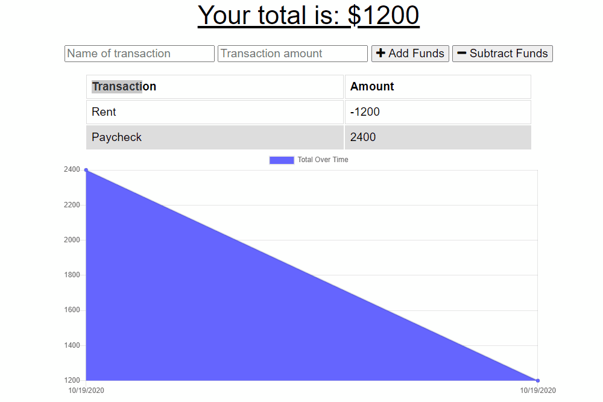

# **Online/Offline Budget Tracker**


## Description 

Giving users a fast and easy way to track their money is important, but allowing them to access that information anytime is even more important. Having offline functionality is paramount to our applications success. GIVEN a user is on Budget App without an internet connection WHEN the user inputs a withdrawal or deposit THEN that will be shown on the page, and added to their transaction history when their connection is back online.

# Technologies Used


## Table of contents

- [Installation](#installation)
- [Instructions](#instructions)
- [Features](#features)
- [Example Gif](#example-gif)
- [Repository Link](#Repository)
- [Test](#Test)
- [Licence](#Licence)
- [GitHub Info](#GitHub)

## Installation

```npm install```

## Instructions

Application deployed on [Heroku](https://jms-pwa-budget-tracker.herokuapp.com/).

## Features

AS AN avid traveller I WANT to be able to track my withdrawals and deposits with or without a data/internet connection SO THAT my account balance is accurate when I am traveling

## Example Gif



## Repository


- [Project Repo](https://github.com/WasteOfADrumBum/HW-18-PWA-Online-Offline-Budget-Trackers)

## Contributors


## Test


## Licence


## GitHub


- Joshua M. Small
- [GitHub Profile](https://github.com/WasteOfADrumBum)
- <JMSmall89@gmail.com>
- 

